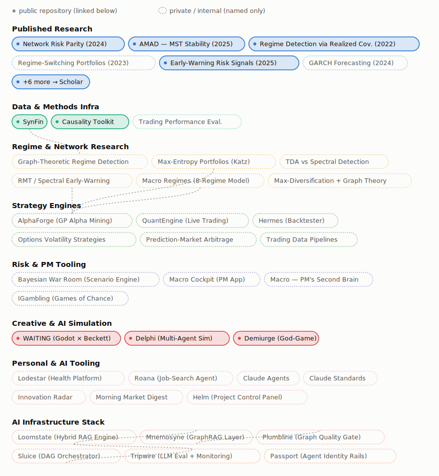

# Vito Ciciretti

**Quantitative researcher and AI specialist.** I build graph-theoretic and regime-detection methods for portfolio construction and risk management — and spend as much effort trying to break them as I do building them.

PhD in Finance *(candidate)*, University of Essex · MSc Artificial Intelligence / Computer Science *(candidate)* · MSc Quantitative Finance, Bocconi University

[LinkedIn](https://www.linkedin.com/in/vitociciretti/) · [Google Scholar](https://scholar.google.com/citations?user=T9wbYUcAAAAJ&hl=en) · vciciretti8@gmail.com

---

## What I actually do

Most of my research treats markets as **networks** rather than an unordered basket of correlations — minimum spanning trees, threshold graphs, spectral and random-matrix methods — and uses that topology to detect regime change and build more robust portfolios.

The other half is methodological honesty. A lot of published "signal" in this space evaporates under a genuinely out-of-sample test, so I spend real effort re-running pipelines with blocked splits, leakage checks, and walk-forward validation — and reporting it plainly when the result is a clean negative rather than an inflated positive.

## Research

- **[Network Risk Parity: graph theory-based portfolio construction](https://link.springer.com/article/10.1057/s41260-023-00347-8)** — *Journal of Asset Management*, 2024 (with A. Pallotta)
- **[Adaptive Market Anomaly Detection (AMAD): enhancing minimum spanning tree stability](https://www.sciencedirect.com/science/article/pii/S1544612325012553)** — *Finance Research Letters*, 2025 (with A. Pallotta)
- **[An early-warning risk signals framework to capture systematic risk in financial markets](https://www.tandfonline.com/doi/abs/10.1080/14697688.2025.2482637)** — *Quantitative Finance*, 2025
- **[Market regime detection via realized covariances](https://arxiv.org/abs/2104.03667)** — *Economic Modelling*, 2022 (with A. Bucci)
- **Building optimal regime-switching portfolios** — *The North American Journal of Economics and Finance*, 2023 (with A. Bucci)

[Full list — 12 publications — on Google Scholar →](https://scholar.google.com/citations?user=T9wbYUcAAAAJ&hl=en)

## Selected open-source work

| Project | What it is |
|---|---|
| **[synfin](https://github.com/vitociciretti/synfin)** | Synthetic financial time-series generator — regime-switching GARCH, factor models, calibrated presets |
| **[causality-toolkit](https://github.com/vitociciretti/causality-toolkit)** | Lead-lag / causality analysis for time series (CCF, Granger, Transfer Entropy, DTW, Wavelet Coherence, CCM) |
| **[delphi](https://github.com/vitociciretti/delphi)** | Multi-agent world-simulation engine, extended with a financial-market scenario layer (built on MiroFish + OASIS) |
| **[demiurge](https://github.com/vitociciretti/demiurge)** | A god-game about simulated reality — a colony of inhabitants tries to notice it's in a simulation |
| **[Godot: The Existentialist Game](https://github.com/vitociciretti/godot-existentialist-game)** | A Beckett two-hander built in the Godot engine — you play one tramp, an LLM plays the other |

## Everything else I've built

The projects above are public and linked; the rest is private research and production work, named below so the shape of it is visible.

<picture>
  <source media="(prefers-color-scheme: dark)" srcset="assets/network-graph-dark.svg">
  
</picture>
